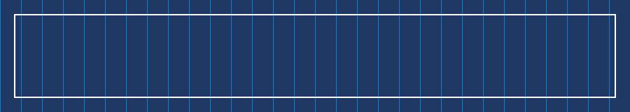
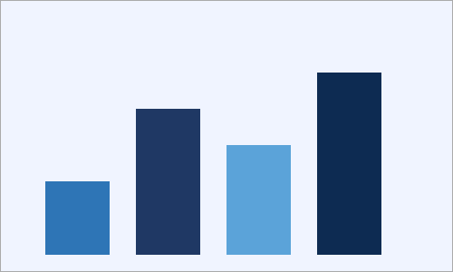
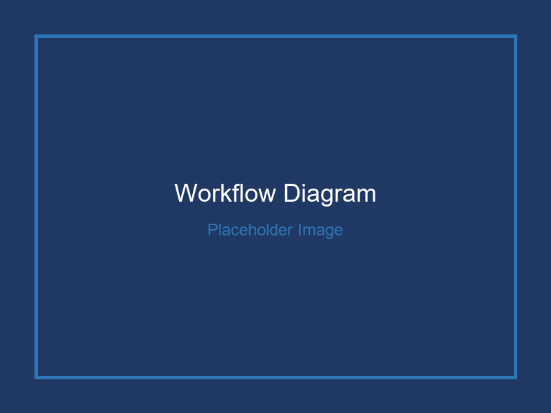
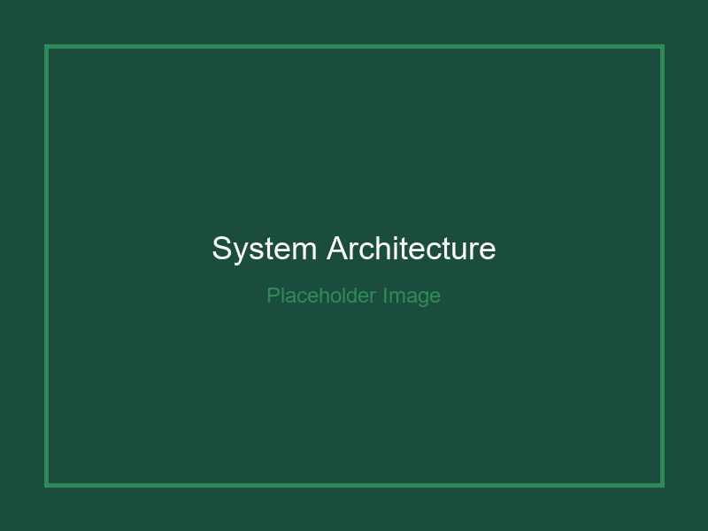
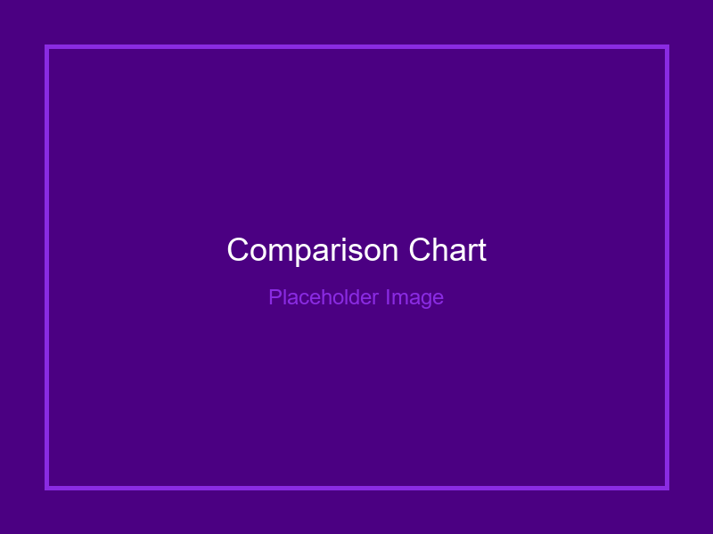

# Introduction

This document serves as a comprehensive demonstration of the md_to_docx converter capabilities. It showcases the various formatting features and document elements that can be automatically converted from Markdown syntax to professional Microsoft Word documents.

## Purpose and Scope

The primary objectives of this showcase are to:

1. **Demonstrate document structure capabilities** including multi-level headings, automatic table of contents generation, and section organization
2. **Present text formatting features** such as emphasis, inline code, and paragraph styling
3. **Illustrate list functionality** including ordered, unordered, and nested list structures
4. **Exhibit table generation** with various formatting options and column width controls
5. **Showcase image handling** including standalone images, figure groups, and size controls
6. **Highlight cross-referencing** capabilities for figures, tables, and sections

+++

# Document Structure

## Heading Hierarchy

The converter supports six levels of headings, automatically numbered and styled with a professional color scheme:

### Level 3 Heading

This demonstrates the third level of the document hierarchy.

#### Level 4 Heading

Fourth level headings provide additional granularity for complex documents.

##### Level 5 Heading

Fifth level headings for detailed subsections.

###### Level 6 Heading

The deepest level of heading hierarchy available.

## Heading Customization

Headings can be excluded from the table of contents using the `{.notoc}` attribute, or numbering can be suppressed with `{.nonumber}`.

+++

# Typography and Text Formatting

## Basic Text Styles

The converter supports standard Markdown text formatting:

*Italic text* is used for emphasis or citations.

**Bold text** draws attention to important information.

***Bold and italic combined*** creates strong emphasis.

~~Strikethrough~~ indicates removed or deprecated content.

## Inline Code

Technical terms and code snippets can be displayed inline using backticks: `function_name()`, `variable_value`, or `CSS_property`.

## Blockquotes

> This is a standard blockquote. It can be used for important notes, citations, or highlighted information that stands out from the main text flow.

Blockquotes feature a distinctive left border and italicized text for visual differentiation.

+++

# Lists and Enumeration

## Unordered Lists

Simple bullet points for itemized information:

* First item in the list
* Second item with additional context
* Third item demonstrating the format

## Ordered Lists

Numbered sequences for procedural documentation:

1. First step in the process
2. Second step with specific details
3. Third step completing the sequence

## Nested Lists

Lists can be nested to show hierarchical relationships:

1. **Main category A**
   * Sub-item A.1
   * Sub-item A.2
     * Detail A.2.1
     * Detail A.2.2
   * Sub-item A.3

2. **Main category B**
   * Sub-item B.1
   * Sub-item B.2

3. **Main category C**
   * Sub-item C.1

This demonstrates the converter's ability to handle complex list structures with proper indentation and formatting.

+++

# Tables

## Standard Data Table

Tables support headers, alternating row shading, and full-width formatting:

| Feature | Status | Priority | Notes |
|---------|--------|----------|-------|
| Heading Numbering | Implemented | High | Configurable via YAML |
| Cross-references | Implemented | High | Bold + Italic style |
| Image Resizing | Implemented | Medium | Size classes supported |
| Table Styling | Implemented | High | Auto-formatting applied |
| Code Blocks | Implemented | Medium | Syntax highlighting |

*Table: Feature implementation status and priorities. {#feature-status}*

As shown in [***Table***](#feature-status), all major features have been successfully implemented with appropriate priority levels assigned.

## Table Without Header

Simple tables without headers are also supported:

|  |  |  |  |
|--|--|--|--|
| Row 1, Cell 1 | Row 1, Cell 2 | Row 1, Cell 3 | Row 1, Cell 4 |
| Row 2, Cell 1 | Row 2, Cell 2 | Row 2, Cell 3 | Row 2, Cell 4 |
| Row 3, Cell 1 | Row 3, Cell 2 | Row 3, Cell 3 | Row 3, Cell 4 |

*Table: Data visualization example without headers.*

## Wide Table with Text Wrapping

Tables automatically handle text wrapping for content that exceeds column widths:

| Component | Description | Implementation Details | Status |
|-----------|-------------|------------------------|--------|
| Parser | Marko library with GFM extensions | Handles all standard Markdown plus GitHub-style alerts and tables | Active |
| Builder | Document assembly engine | Manages section breaks, page numbering, and TOC generation | Active |
| Styles | Custom style definitions | Heading hierarchy, code blocks, captions, and alerts | Active |
| Images | Processing pipeline | Size calculation, aspect ratio preservation, placement | Active |

*Table: System architecture components with detailed descriptions. {#architecture}*

Refer to [***Table***](#architecture) for a complete overview of the system architecture.

## Table with Custom Column Widths

Tables can have custom column widths specified as percentages using the `{col-widths="..."}` directive placed immediately after the table:

| Short | Medium | Long Description |
|-------|--------|------------------|
| ID | Category | Detailed explanation of the feature or component |
| 001 | Parser | Handles Markdown syntax parsing with GFM extensions |
| 002 | Builder | Assembles the document structure and applies formatting |

{col-widths="15%,25%,60%"}

*Table: Example table with custom column width distribution. {#col-widths-example}*

In this example, the first column occupies 15% of the table width, the second column 25%, and the third column (containing longer descriptions) occupies 60% of the available space.

+++

# Images and Figures

## Standalone Images

### Full-Width Image

Large images can be displayed at full content width for maximum impact:

{.xl}

*Figure: Complete system overview diagram showing all major components and their relationships. {#system-overview}*

As illustrated in [***Figure***](#system-overview), the system architecture consists of four primary modules working in concert.

### Left-Aligned Image

Images can be positioned on the left side with text flowing alongside:

{.small .left}

*Figure: Individual module icon representing the parsing engine.*

This layout demonstrates how content wraps around left-aligned images. The parsing module serves as the foundation of the conversion pipeline, responsible for transforming raw Markdown syntax into an abstract syntax tree (AST) that the builder can process.

### Centered Medium Image

The default presentation centers images within the content area:

{.medium}

*Figure: Data flow diagram showing information pathways through the system. {#data-flow}*

## Figure Groups

Multiple images can be displayed side-by-side for comparison purposes:

:::figures
{.medium}
{.medium}
{.medium}
:::

*Figure: Three-phase processing pipeline: input parsing, document building, and quality validation. {#pipeline}*

The figure group above, referenced as [***Figure***](#pipeline), demonstrates how multiple related images can be presented together with individual sub-captions (a, b, c) and an overall group caption.

+++

# Cross-References and Linking

## Internal References

The document supports cross-referencing to:

Sections (e.g., [Section 4.2](#lists-and-enumeration) covers list functionality)

## External Hyperlinks

External resources can be linked directly: [Markdown Specification](https://commonmark.org) or [Microsoft Word Documentation](https://support.microsoft.com).

+++

# Code Examples

## Python Code Block

```python
def process_markdown(source_file, config):
    """
    Main entry point for markdown processing.
    
    Args:
        source_file: Path to markdown input
        config: Dictionary of configuration options
        
    Returns:
        Document: Generated Word document object
    """
    builder = DocumentBuilder(config)
    builder.setup()
    
    with open(source_file, 'r') as f:
        content = f.read()
    
    builder.add_content(content)
    return builder.doc
```

*Code Block 1: Python implementation of the main processing function.*

## JavaScript Code Block

```javascript
// Configuration parser for document settings
function parseConfig(configPath) {
  const fs = require('fs');
  const yaml = require('js-yaml');
  
  try {
    const config = yaml.load(fs.readFileSync(configPath, 'utf8'));
    return {
      margins: config.page || {},
      header: config.header || {},
      footer: config.footer || {},
      document: config.document || {}
    };
  } catch (error) {
    console.error('Configuration error:', error);
    return {};
  }
}
```

*Code Block 2: JavaScript configuration parser implementation.*

+++

# Special Elements

## Alert Boxes

GitHub-style alerts provide visual emphasis for different message types:

> [!NOTE]
> This is an informational note. It provides additional context or helpful information that supplements the main content.

> [!TIP]
> This is a helpful tip. Tips offer practical advice or shortcuts that can improve workflow efficiency.

> [!WARNING]
> This is a warning message. Warnings indicate potential issues or important considerations that require attention.

> [!CAUTION]
> This is a caution alert. Cautions highlight actions that could cause problems if not handled carefully.

## Horizontal Rules

Horizontal rules can be used to separate sections visually:

+++

They create a clear break without starting a new page.

+++

## Vertical Space

The `:::space` directive provides precise vertical spacing control, ideal for fine-tuning layout on cover pages and between sections.

Use `lines` to insert space measured in body-text lines (11 pt per line):

:::space{lines=3}

Or use `pt` for an exact point value:

:::space{pt=24}

Both examples above create white space without forcing a page break.

+++

# Appendix {.nonumber}

## A. Supported Markdown Extensions {.nonumber}

### A.1 GitHub Flavored Markdown {.nonumber}

The converter fully supports GFM syntax including:

* Tables with alignment
* Task lists (converted to bullet points)
* Strikethrough text
* Autolinks

### A.1.1 Table Alignment

Tables support column alignment through colon placement:

| Left | Center | Right |
|:-----|:------:|------:|
| L1   | C1     | R1    |
| L2   | C2     | R2    |

### A.2 Custom Extensions

Additional features beyond standard Markdown:

* Image sizing with `{.xs}`, `{.small}`, `{.medium}`, `{.large}`, `{.xl}`
* Alignment classes: `{.left}`, `{.center}`, `{.right}`
* Heading attributes: `{.notoc}`, `{.nonumber}`
* Figure groups with `:::figures` blocks
* Custom column widths: `{col-widths="20%,30%,50%"}`

## B. Configuration Options {.nonumber}

### B.1 Document Metadata {.nonumber}

Controlled via `config.yaml`:

1. **Document properties**: title, author, date, version
2. **Page layout**: margins, paper size, orientation
3. **Headers and footers**: content, alignment, dynamic fields

### B.1.1 Dynamic Fields {.nonumber}

Headers and footers support placeholder substitution:

* `{title}` - Document title from config
* `{author}` - Author name from config
* `{date}` - Document date from config
* `{page}` - Current page number
* `{total}` - Total page count

### B.2 Styling Options {.nonumber}

Visual presentation controlled through:

* **Heading colors**: Alternating dark blue and medium blue
* **Numbered headings**: Optional sequential numbering
* **Code formatting**: Grey background with monospace font
* **Table styling**: Alternating row shading, header formatting

## C. Property Substitution {.nonumber}

Dynamic values can be inserted using `{{property}}` syntax from `properties.yaml`. This enables template-based document generation where specific values are populated at build time.

### C.1 Usage Examples {.nonumber}

The converter supports **{{features.heading_count}}** heading levels and **{{features.table_types}}** table styles. The **{{project.name}}** project is currently at version **{{project.version}}** and has processed over **{{statistics.files_processed}}** files.

### C.2 Configuration Data {.nonumber}

Based on the configuration:

* **Supported formats**: {{capabilities.supported_formats}}
* **Parser engine**: {{capabilities.parser}}
* **Maximum heading depth**: {{capabilities.max_heading_levels}} levels
* **Available image sizes**: {{features.image_sizes}}
* **Alert types**: {{features.alert_types}}
* **Code language support**: {{capabilities.supported_languages}}

These values demonstrate how properties from YAML files are dynamically inserted into the document content at conversion time.

---

*End of Document*
